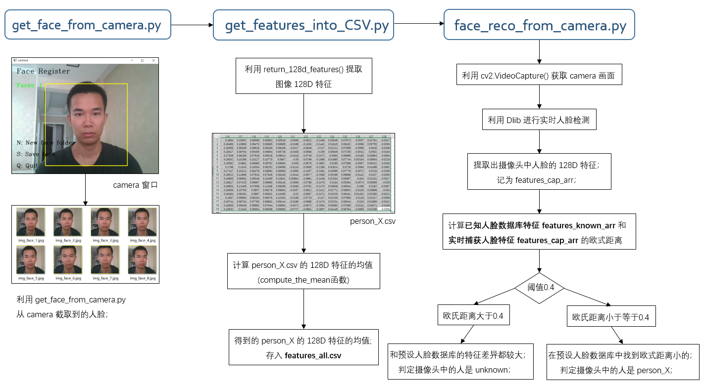
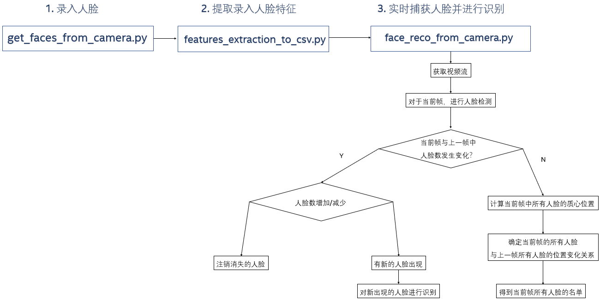

Face recognition from camera with Dlib
######################################

Introduction
************

Detect and recognize single/multi-faces from camera;

调用摄像头进行人脸识别, 支持多张人脸同时识别;

#. 摄像头人脸录入 / Face register

   .. image:: introduction/face_register.png
      :align: center

   请不要离摄像头过近, 人脸超出摄像头范围时会有 "OUT OF RANGE" 提醒 /
   Please do not be too close to the camera, or you can't save faces with "OUT OF RANGE" warning;

   .. image:: introduction/face_register_warning.png
      :align: center

#. 提取特征建立人脸数据库 / Generate face database from images captured
#. 利用摄像头进行人脸识别 / Face recognizer
   
   face_reco_from_camera.py, 对于每一帧都做检测识别 / Do detection and recognition for every frame:
   
   .. image:: introduction/face_reco.png
      :align: center

   face_reco_from_camera_single_face.py, 对于人脸<=1, 只有新人脸出现才进行再识别来提高 FPS / Do re-reco only for new single face:

   .. image:: introduction/face_reco_single.png
      :align: center

   face_reco_from_camera_ot.py, 利用 OT 来实现再识别提高 FPS / Use OT to instead of re-reco for every frame to improve FPS:

   .. image:: introduction/face_reco_ot.png
      :align: center

   定制显示名字, 可以写中文 /  Show chinese name:

   .. image:: introduction/face_reco_chinese_name.png
      :align: center

** 关于精度 / About accuracy:

* When using a distance threshold of ``0.6``, the dlib model obtains an accuracy of ``99.38%`` on the standard LFW face recognition benchmark.

** 关于算法 / About algorithm

* 基于 Residual Neural Network / 残差网络的 CNN 模型;

* This model is a ResNet network with 29 conv layers. It's essentially a version of the ResNet-34 network from the paper Deep Residual Learning for Image Recognition by He, Zhang, Ren, and Sun with a few layers removed and the number of filters per layer reduced by half.

Overview
********

此项目中人脸识别的实现流程 (no OT, 每一帧都进行检测+识别) / The design of this repo:

实现流程(with OT, 初始帧进行检测+识别, 后续帧检测+质心跟踪) / The design of this repo:

如果利用 OT 来跟踪, 可以大大提高 FPS, 因为做识别时候需要提取特征描述子的耗时很多;

Steps
*****

#. 安装依赖库 / Install some python packages needed

   .. code-block:: bash

      pip3 install opencv-python
      pip3 install scikit-image
      pip3 install dlib

#. 下载源码 / Download zip from website or via GitHub Desktop in windows, or git clone repo in Ubuntu

   .. code-block:: bash

      git clone https://github.com/coneypo/Dlib_face_recognition_from_camera

#. 进行人脸信息采集录入 / Register faces 

   .. code-block:: bash

      python3 get_face_from_camera.py

#. 提取所有录入人脸数据存入 "features_all.csv" / Features extraction and save into "features_all.csv"

   .. code-block:: bash

      python3 features_extraction_to_csv.py

#. 调用摄像头进行实时人脸识别 / Real-time face recognition

   .. code-block:: bash

      python3 face_reco_from_camera.py

#. 对于人脸数<=1, 调用摄像头进行实时人脸识别 / Real-time face recognition (FPS improved)

   .. code-block:: bash

      python3 face_reco_from_camera_single_face.py

#. 利用 OT 算法, 调用摄像头进行实时人脸识别 / Real-time face recognition with OT (FPS improved)

   .. code-block:: bash

      python3 face_reco_from_camera_ot.py

About Source Code
*****************

Repo 的 tree / 树状图:

::

    .
    ├── get_faces_from_camera.py        		# Step 1. Face register
    ├── features_extraction_to_csv.py   		# Step 2. Feature extraction
    ├── face_reco_from_camera.py        		# Step 3. Face recognizer
    ├── face_reco_from_camera_single_face.py    # Step 3. Face recognizer for single person
    ├── face_reco_from_camera_ot.py             # Step 3. Face recognizer with OT
    ├── face_descriptor_from_camera.py  		# Face descriptor computation
    ├── how_to_use_camera.py            		# Use the default camera by opencv
    ├── data
    │   ├── data_dlib        			    # Dlib's model
    │   │   ├── dlib_face_recognition_resnet_model_v1.dat
    │   │   └── shape_predictor_68_face_landmarks.dat
    │   ├── data_faces_from_camera        # Face images captured from camera (will generate after step 1)
    │   │   ├── person_1
    │   │   │   ├── img_face_1.jpg
    │   │   │   └── img_face_2.jpg
    │   │   └── person_2
    │   │       └── img_face_1.jpg
    │   │       └── img_face_2.jpg
    │   └── features_all.csv            	# CSV to save all the features of known faces (will generate after step 2)
    ├── README.rst
    └── requirements.txt                		# Some python packages needed

用到的 Dlib 相关模型函数:

#. Dlib 正向人脸检测器 (based on HOG), output: <class 'dlib.dlib.rectangles'>

   .. code-block:: python

      detector = dlib.get_frontal_face_detector()
      faces = detector(img_gray, 0)

	  
#. Dlib 人脸 landmark 特征点检测器, output: <class 'dlib.dlib.full_object_detection'>,
   will use shape_predictor_68_face_landmarks.dat

   .. code-block:: python

      # This is trained on the ibug 300-W dataset (https://ibug.doc.ic.ac.uk/resources/facial-point-annotations/)
      # Also note that this model file is designed for use with dlib's HOG face detector.
      # That is, it expects the bounding boxes from the face detector to be aligned a certain way, the way dlib's HOG face detector does it.
      # It won't work as well when used with a face detector that produces differently aligned boxes,
      # such as the CNN based mmod_human_face_detector.dat face detector.

      predictor = dlib.shape_predictor("data/data_dlib/shape_predictor_68_face_landmarks.dat")
      shape = predictor(img_rd, faces[i])

	  
#. Dlib 特征描述子 Face recognition model, the object maps human faces into 128D vectors

   .. code-block:: python

      face_rec = dlib.face_recognition_model_v1("data/data_dlib/dlib_face_recognition_resnet_model_v1.dat")

Python 源码介绍如下:

#. get_face_from_camera.py: 

   进行 Face register / 人脸信息采集录入

   * 请注意存储人脸图片时, 矩形框不要超出摄像头范围, 要不然无法保存到本地;
   * 超出会有 "out of range" 的提醒;

#. features_extraction_to_csv.py:
     
   从上一步存下来的图像文件中, 提取人脸数据存入CSV;
  
   * 会生成一个存储所有特征人脸数据的 "features_all.csv"；
   * size: n*128 , n means n people you registered and 128 means 128D features of the face

#. face_reco_from_camera.py: 

   这一步将调用摄像头进行实时人脸识别; / This part will implement real-time face recognition;
  
   * Compare the faces captured from camera with the faces you have registered which are saved in "features_all.csv"
   
   * 将捕获到的人脸数据和之前存的人脸数据进行对比计算欧式距离, 由此判断是否是同一个人;

#. face_reco_from_camera_single_face.py:
	
   针对于人脸数 <=1 的场景, 区别于 face_reco_from_camera.py (对每一帧都进行检测+识别), 只有人脸出现的时候进行识别;

#. face_reco_from_camera_ot.py:

   只会对初始帧做检测+识别, 对后续帧做检测+质心跟踪;

#. (optional) face_descriptor_from_camera.py

   调用摄像头进行实时特征描述子计算; / Real-time face descriptor computation;

More
****

Tips:

#. 如果希望详细了解 dlib 的用法, 请参考 Dlib 官方 Python api 的网站 / You can refer to this link for more information of how to use dlib: http://dlib.net/python/index.html

#. Modify log level to ``logging.basicConfig(level=logging.DEBUG)`` to print info for every frame if needed (Default is ``logging.INFO``)

#. 代码最好不要有中文路径 / No chinese characters in your code directory

#. 人脸录入的时候先建文件夹再保存图片, 先 ``N`` 再 ``S`` / Press ``N`` before ``S``

#. 关于 `face_reco_from_camera.py` 人脸识别卡顿 FPS 低问题, 原因是特征描述子提取很费时间, 光跑 face_descriptor_from_camera.py 中 
face_reco_model.compute_face_descriptor 在我的机器上得到的平均 FPS 在 5 左右 (检测在 0.03s, 特征描述子提取在 0.158s, 和已知人脸进行遍历对比在 0.003s 左右),
所以主要提取特征时候耗资源, 可以用 OT 去做追踪 (使用`face_reco_from_camera_ot.py`), 而不是对每一帧都做检测+识别, 识别的性能从 20 FPS -> 200 FPS

可以访问我的博客获取本项目的更详细介绍, 如有问题可以邮件联系我 /
For more details, please refer to my blog (in chinese) or mail to me :

* Blog: https://www.cnblogs.com/AdaminXie/p/9010298.html

* 关于 OT 部分的更新在 Blog: https://www.cnblogs.com/AdaminXie/p/13566269.html
  
* Mail: coneypo@foxmail.com ( Dlib 相关 repo 问题请联系 @foxmail 而不是 @intel )

* Feel free to creatE issue or PR for this repo :)

Thanks for your support.
