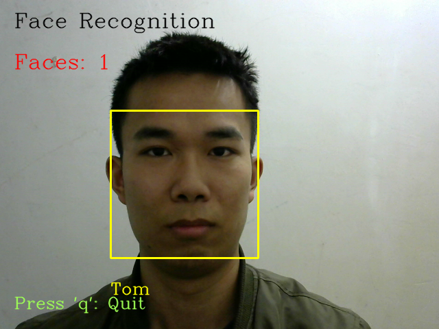

Face recognition from camera
############################

Introduction
************

Detect and recognize single/multi-faces from camera;

调用摄像头进行人脸识别，支持多张人脸同时识别;

#. 摄像头人脸录入 / Face register

   .. image:: introduction/get_face_from_camera.png
      :align: center

   请不要离摄像头过近，人脸超出摄像头范围时会有 "OUT OF RANGE" 提醒 /
   Please do not too close to the camera, or you can't save faces with "OUT OF RANGE" warning;

   .. image:: introduction/get_face_from_camera_out_of_range.png
      :align: center

#. 提取特征建立人脸数据库 / Generate database from images captured
#. 利用摄像头进行人脸识别 / Face recognizer
   
   当单张人脸 / When single-face:
   
   .. image:: introduction/face_reco_single_person.png
      :align: center

   当多张人脸 / When multi-faces:
   
   .. image:: introduction/face_reco_two_people.png
      :align: center

** 关于精度 / About accuracy:

* When using a distance threshold of ``0.6``, the dlib model obtains an accuracy of ``99.38%`` on the standard LFW face recognition benchmark.

Overview
********

此项目中人脸识别的实现流程 / The design of this repo:

.. image:: introduction/overview.png
   :align: center

Steps
*****

#. 下载源码 / Download from website or via GitHub Desktop in windows, or clone repo in Ubuntu

   .. code-block:: bash

      git clone https://github.com/coneypo/Dlib_face_recognition_from_camera

#. 进行 face register / 人脸信息采集录入

   .. code-block:: bash

      python3 get_face_from_camera.py

#. 提取所有录入人脸数据存入 features_all.csv

   .. code-block:: bash

      python3 get_features_into_CSV.py

#. 调用摄像头进行实时人脸识别

   .. code-block:: bash

      python3 face_reco_from_camera.py

About Source Code
*****************

Python 源码介绍如下:

#. get_face_from_camera.py: 

   进行 Face register / 人脸信息采集录入

   * 请注意存储人脸图片时，矩形框不要超出摄像头范围，要不然无法保存到本地;
   * 超出会有 "out of range" 的提醒;

#. get_features_into_CSV.py: 
     
   从上一步存下来的图像文件中，提取人脸数据存入CSV;
  
   * 会生成一个存储所有特征人脸数据的 "features_all.csv"；
   * size: n*128 , n means n people you registered and 128 means 128D features of the face

#. face_reco_from_camera.py: 

   这一步将调用摄像头进行实时人脸识别; / This part will implement real-time face recognition;
  
   * Compare the faces captured from camera with the faces you have registered which are saved in "features_all.csv"
   
   * 将捕获到的人脸数据和之前存的人脸数据进行对比计算欧式距离, 由此判断是否是同一个人;

修改显示的人名 / If you want customize the names shown, please refer to this patch and modify the code: https://github.com/coneypo/Dlib_face_recognition_from_camera/commit/58466ce87bf3a42ac5ef855b791bf8c658d408df?diff=unified
face_reco_single_person_custmize_name.png

More
****

Tips:

1. Windows下建议不要把代码放到 ``C:\``, 可能会出现权限读取问题

2. 代码最好不要有中文路径

3. 人脸录入的时候先建文件夹再保存图片, 先 ``N`` 再 ``S``

For more details, please refer to my blog (in chinese) or mail to me /

可以访问我的博客获取本项目的更详细介绍，如有问题可以邮件联系我:

* Blog: https://www.cnblogs.com/AdaminXie/p/9010298.html
  
* Mail: coneypo@foxmail.com

仅限于交流学习, 商业合作勿扰;

Thanks for your support.